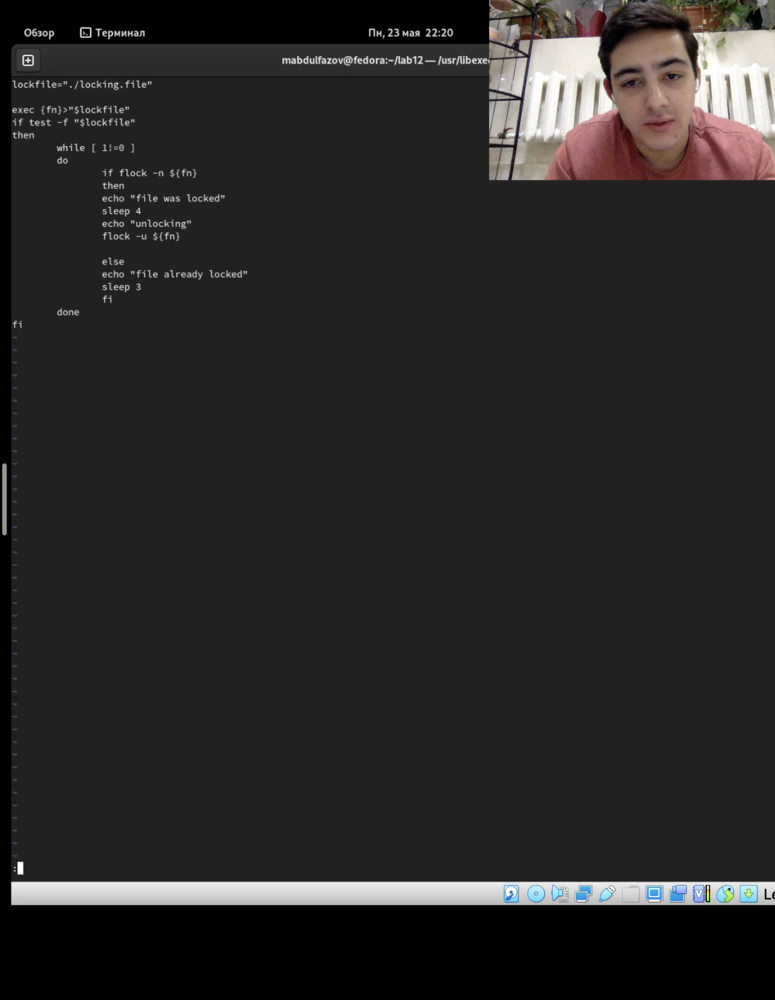
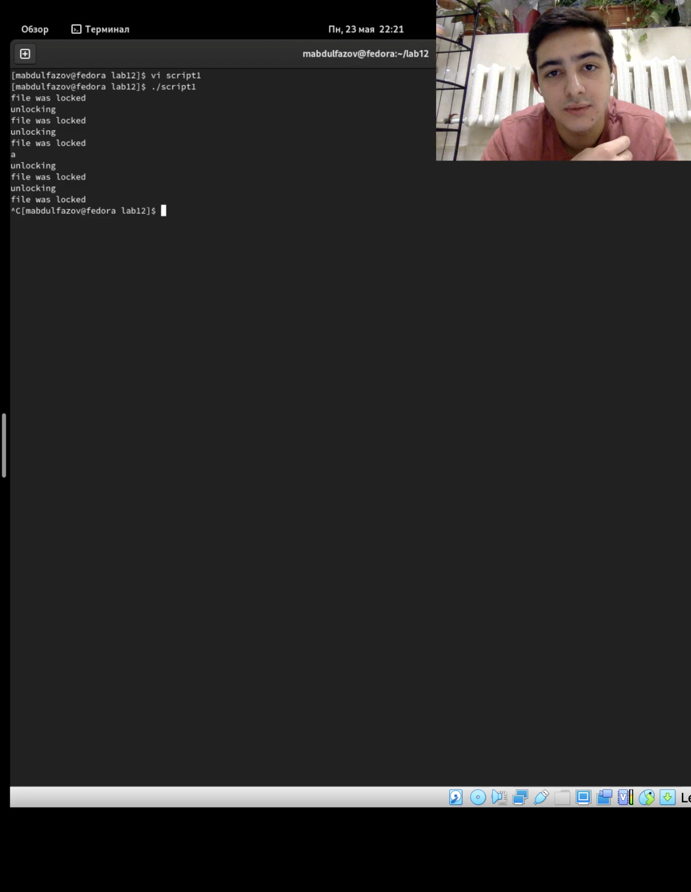
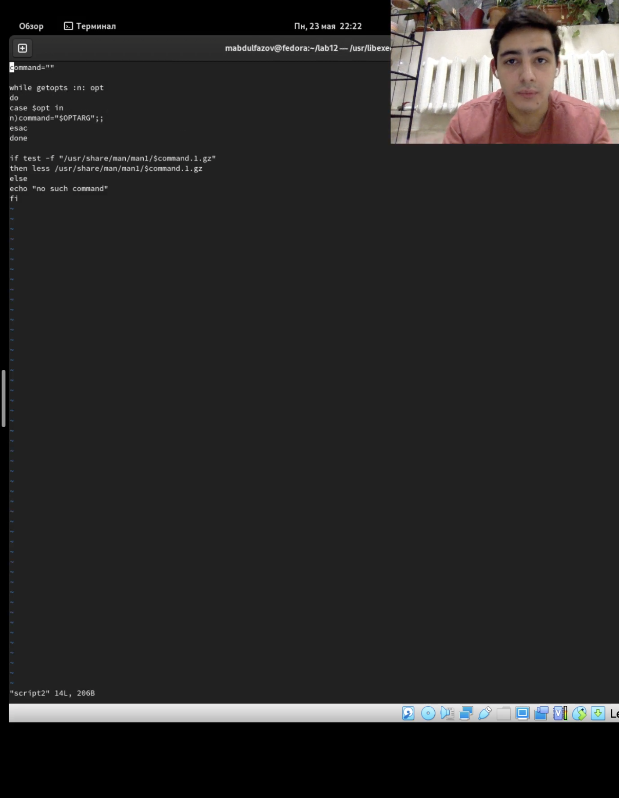
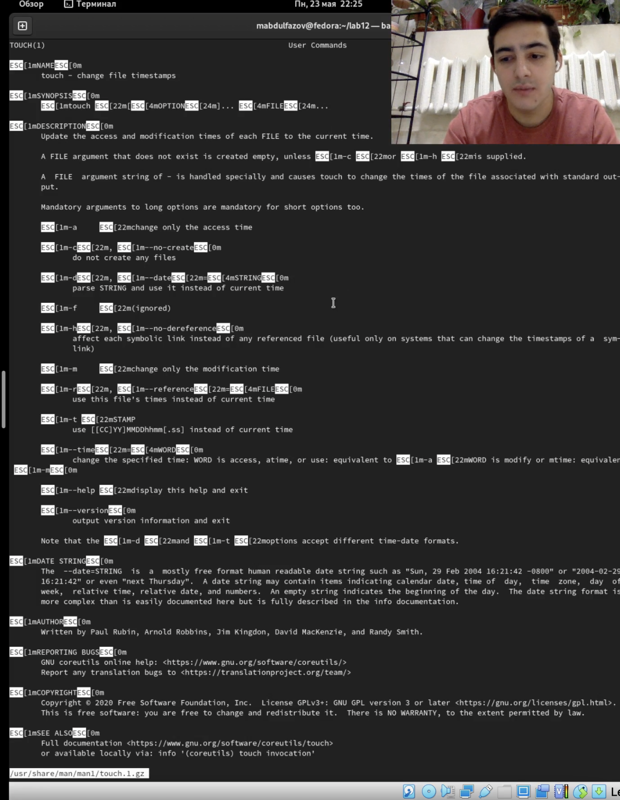
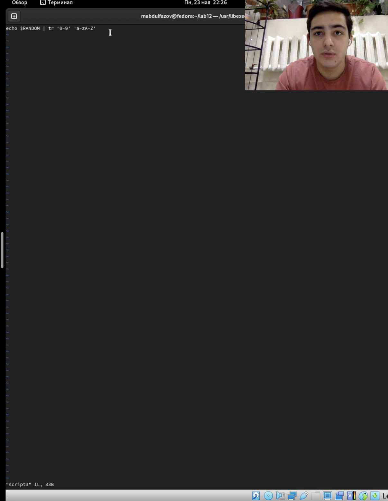
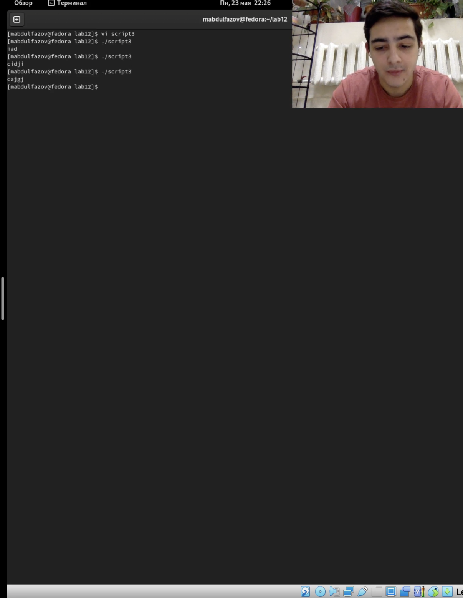

---
## Front matter
lang: ru-RU
title: Программирование в командном процессоре ОС UNIX. Расширенное программирование
author: Мансур А. о. Абдулфазов\inst{1,3}
        Группа НФИбд-01-21
date: 24 мая, 2021, Россия, Москва

## Formatting
toc: false
slide_level: 2
theme: metropolis
header-includes: 
 - \metroset{progressbar=frametitle,sectionpage=progressbar,numbering=fraction}
 - '\makeatletter'
 - '\beamer@ignorenonframefalse'
 - '\makeatother'
aspectratio: 43
section-titles: true
---

## Цель работы

Изучить основы программирования в оболочке ОС UNIX. Научиться писать более сложные командные файлы с использованием логических управляющих конструкций и циклов.

## Выполнение лабораторной работы

1. Скрипт 1 (рис. 1)

{ #fig:001 width=90% }

##

Запуск (рис. 2)

{ #fig:002 width=90% }

##

2. Скрипт 2 (рис. 3)

{ #fig:003 width=90% }

##

Запуск (рис. 4)

{ #fig:004 width=90% }

##

3. Скрипт 3 (рис. 5)

{ #fig:005 width=90% }

##

Запуск (рис. 6)

{ #fig:006 width=90% }

## Вывод

Научился писать более сложные командные файлы с использованием логических управляющих конструкций и циклов.
