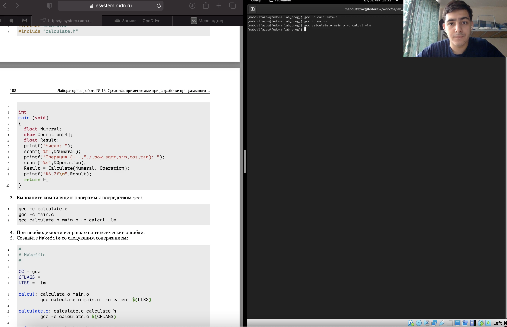
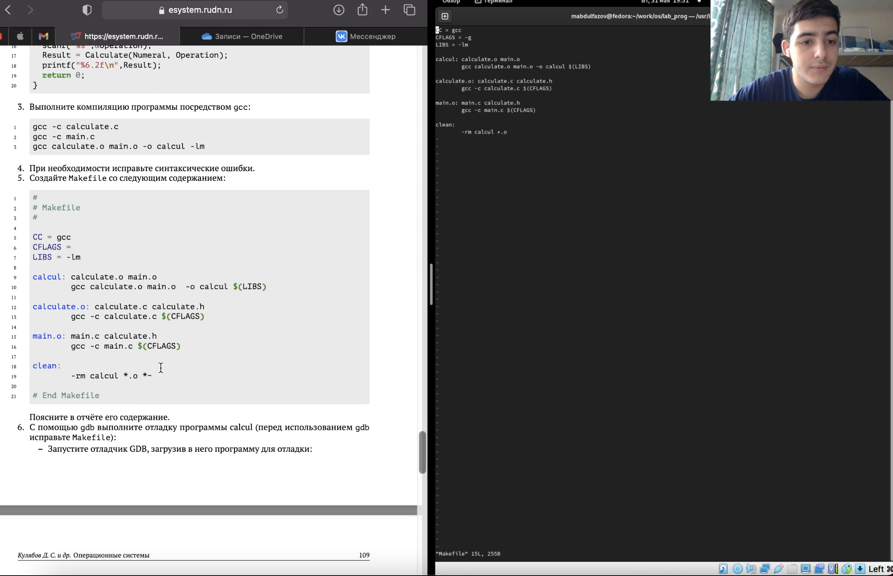
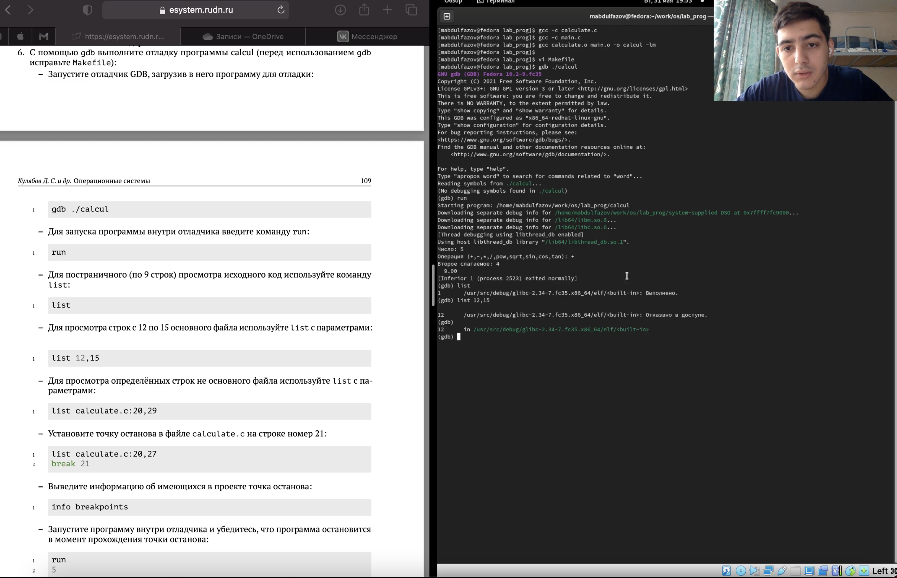
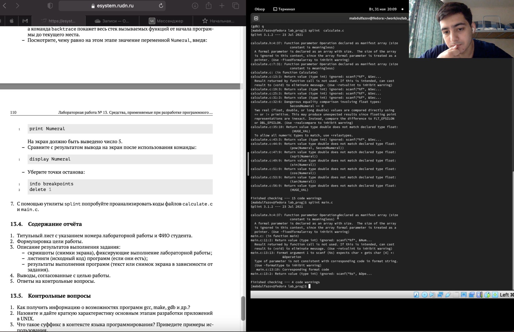

---
## Front matter
lang: ru-RU
title: Средства, применяемые при разработке программного обеспечения в ОС типа UNIX/Linux
author: Мансур А. о. Абдулфазов\inst{1,3}
        Группа НФИбд-01-21
date: 31 мая, 2021, Россия, Москва

## Formatting
toc: false
slide_level: 2
theme: metropolis
header-includes: 
 - \metroset{progressbar=frametitle,sectionpage=progressbar,numbering=fraction}
 - '\makeatletter'
 - '\beamer@ignorenonframefalse'
 - '\makeatother'
aspectratio: 43
section-titles: true
---

## Цель работы

Приобрести простейшие навыки разработки, анализа, тестирования и отладки приложений в ОС типа UNIX/Linux на примере создания на языке программирования С калькулятора с простейшими функциями.

## Выполнение лабораторной работы

1. Скомпилировал все созданные файлы(данные по заданию в лабораторной работе) (рис. 1)

{ #fig:001 width=90% }

##

2. Исправил синтаксические ошибки в файле Makefile (рис. 2)

{ #fig:002 width=90% }

##

3. Проверил работу калькулятора с помощью отладчика gdb (рис. 3)

{ #fig:003 width=90% }

##

4. Проанализировал файлы calculate.c и main.c с помощью утилиты splint (рис. 4)

{ #fig:004 width=90% }

## Вывод

Приобрёл простейшие навыки разработки, анализа, тестирования и отладки приложений в ОС типа UNIX/Linux на примере создания на языке программирования С калькулятора с простейшими функциями.
