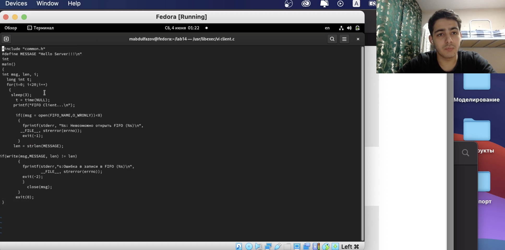
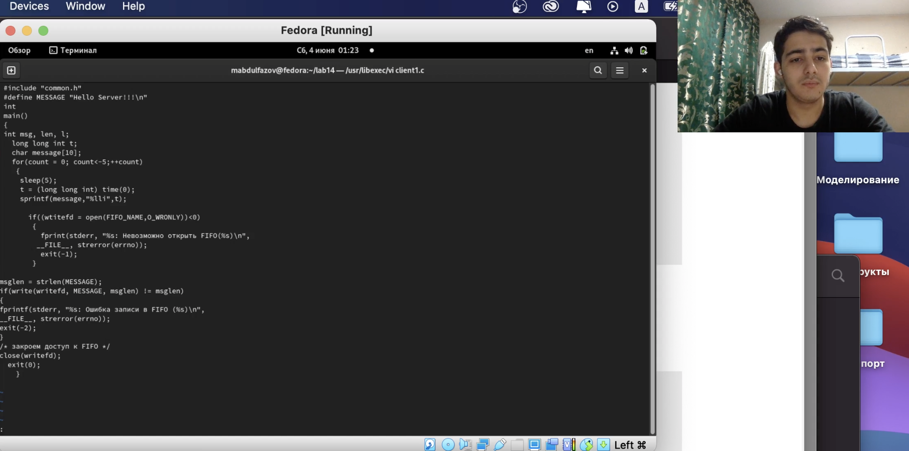
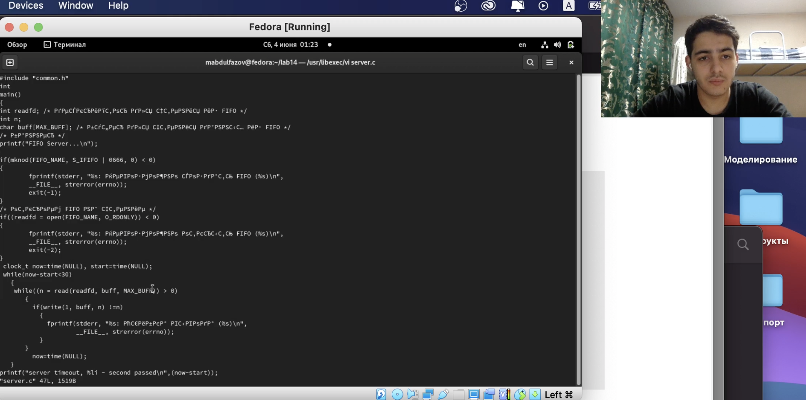
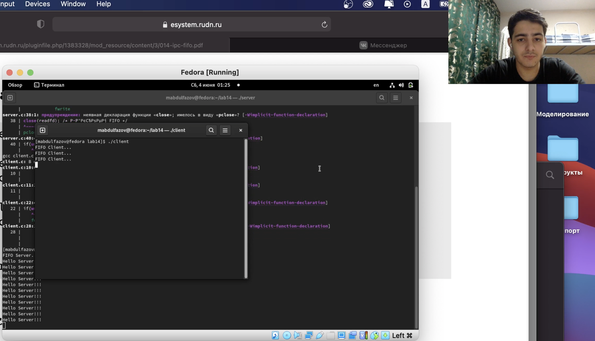

---
## Front matter
lang: ru-RU
title: Именованные каналы
author: Мансур А. о. Абдулфазов\inst{1,3}
        Группа НФИбд-01-21
date: 4 июня, 2021, Россия, Москва

## Formatting
toc: false
slide_level: 2
theme: metropolis
header-includes: 
 - \metroset{progressbar=frametitle,sectionpage=progressbar,numbering=fraction}
 - '\makeatletter'
 - '\beamer@ignorenonframefalse'
 - '\makeatother'
aspectratio: 43
section-titles: true
---

## Цель работы

Приобретение практических навыков работы с именованными каналами.

## Выполнение лабораторной работы

1. Файл client.c (рис. 1)

{ #fig:001 width=90% }

##

2. Файл client1.c  (рис. 2)

{ #fig:002 width=90% }

##

3. Файл server.c (рис. 3)

{ #fig:003 width=90% }

##

4. Результат выполненной работы (рис. 4)

{ #fig:004 width=90% }

## Вывод

Приобрёл практические навыки работы с именованными каналами.