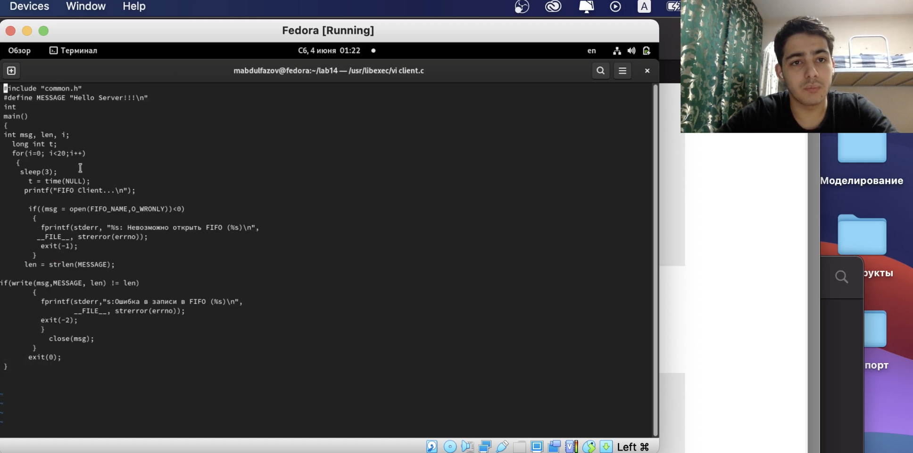
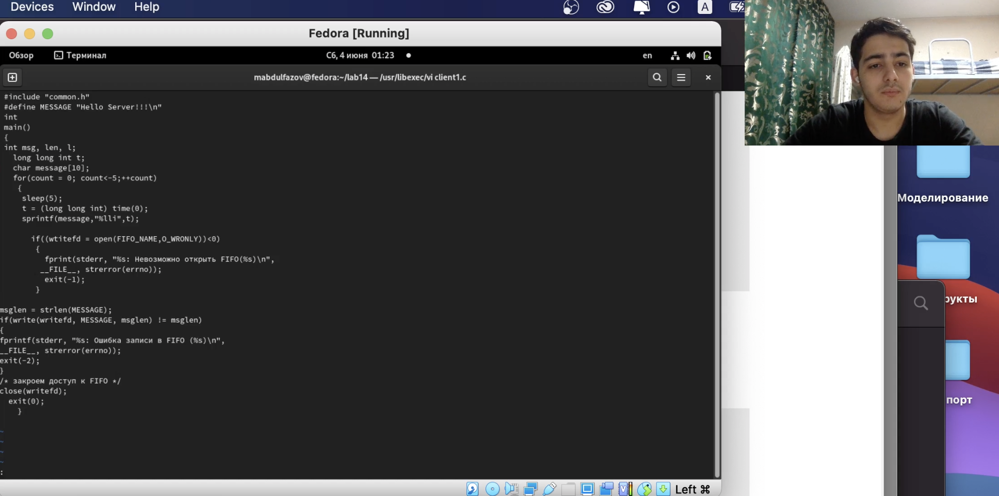
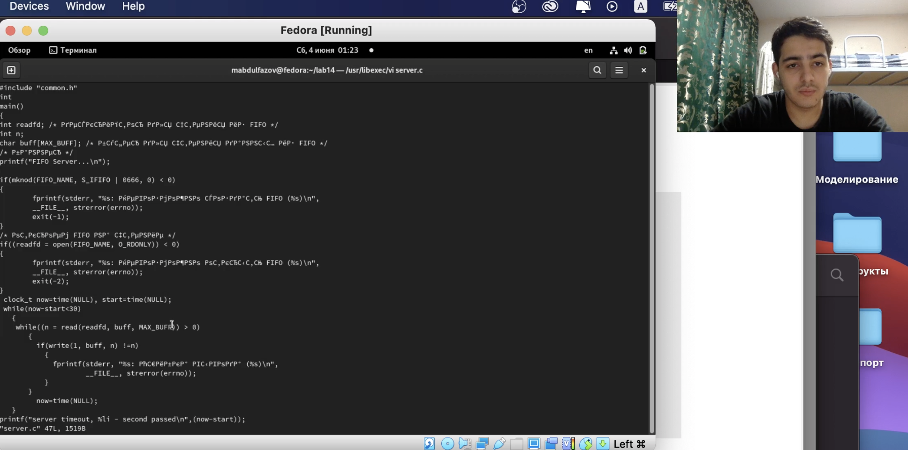
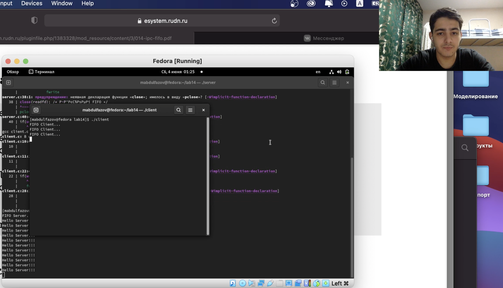

---
# Front matter
lang: ru-RU
title: "Лабораторная работа 14"
subtitle: "Именованные каналы"
author: "Абдулфазов Мансур али оглы"

# Formatting
toc-title: "Содержание"
toc: true # Table of contents
toc_depth: 2
fontsize: 12pt
linestretch: 1.5
papersize: a4paper
documentclass: scrreprt
polyglossia-lang: russian
polyglossia-otherlangs: english
mainfont: PT Serif
romanfont: PT Serif
sansfont: PT Sans
monofont: PT Mono
mainfontoptions: Ligatures=TeX
romanfontoptions: Ligatures=TeX
sansfontoptions: Ligatures=TeX,Scale=MatchLowercase
monofontoptions: Scale=MatchLowercase
indent: true
pdf-engine: lualatex
header-includes:
  - \linepenalty=10 # the penalty added to the badness of each line within a paragraph (no associated penalty node) Increasing the value makes tex try to have fewer lines in the paragraph.
  - \interlinepenalty=0 # value of the penalty (node) added after each line of a paragraph.
  - \hyphenpenalty=50 # the penalty for line breaking at an automatically inserted hyphen
  - \exhyphenpenalty=50 # the penalty for line breaking at an explicit hyphen
  - \binoppenalty=700 # the penalty for breaking a line at a binary operator
  - \relpenalty=500 # the penalty for breaking a line at a relation
  - \clubpenalty=150 # extra penalty for breaking after first line of a paragraph
  - \widowpenalty=150 # extra penalty for breaking before last line of a paragraph
  - \displaywidowpenalty=50 # extra penalty for breaking before last line before a display math
  - \brokenpenalty=100 # extra penalty for page breaking after a hyphenated line
  - \predisplaypenalty=10000 # penalty for breaking before a display
  - \postdisplaypenalty=0 # penalty for breaking after a display
  - \floatingpenalty = 20000 # penalty for splitting an insertion (can only be split footnote in standard LaTeX)
  - \raggedbottom # or \flushbottom
  - \usepackage{float} # keep figures where there are in the text
  - \floatplacement{figure}{H} # keep figures where there are in the text
---

# Цель работы

Приобретение практических навыков работы с именованными каналами.

# Выполнение лабораторной работы

1. Файл client.c (рис. 1)

{ #fig:001 width=90% }

2. Файл client1.c  (рис. 2)

{ #fig:002 width=90% }

3. Файл server.c (рис. 3)

{ #fig:003 width=90% }

4. Результат выполненной работы (рис. 4)

{ #fig:004 width=90% }

# Вывод

Приобрёл практические навыки работы с именованными каналами.

# Контрольные вопросы

1: **В чем ключевое отличие именованных каналов от неименованных?**

Именованные каналы, в отличие от неименованных, могут использоваться неродственными процессами. Они дают вам, по сути, те же возможности, что и неименованные каналы, но с некоторыми преимуществами, присущими обычным файлам. Именованные каналы используют специальную запись в директории для управления правами доступа.

2:	**Возможно ли создание неименованного канала из командной строки?**

Да, возможно

3:	**Возможно ли создание именованного канала из командной строки?**

Да, возможно

4:	**Какой результат даст вычисление выражения \$((10/3))?**

`CreatePipe` используется для создания неименованного канала.

5:	**Опишите функцию языка,создающую именованный канал.**

Функции стандартной библиотеки Си, такие, как fopen, fread, fwrite и fclose позволяют обращаться к именованному каналу.

6:	**Что будет в случае прочтения из fifo меньшего числа байтов,чем находится в канале? Большего числа байтов?**

При чтении меньшего числа байтов, чем находится в канале или FIFO, возвращается требуемое число байтов, остаток сохраняется для последующих чтений.
При чтении большего числа байтов, чем находится в канале или FIFO, возвращается доступное число байтов. Процесс, читающий из канала, должен соответствующим образом обработать ситуацию, когда прочитано меньше, чем заказано.

7:	**Что будет в случае записи из fifo меньшего числа байтов,чем находится в канале? Большего числа байтов?**

Запись числа байтов, меньшего емкости канала или FIFO, гарантированно атомарно. Это означает, что в случае, когда несколько процессов одновременно записывают в канал, порции данных от этих процессов не перемешиваются.
При записи большего числа байтов, чем это позволяет канал или FIFO, вызов _write(2)_ блокируется до освобождения требуемого места. При этом атомарность операции не гарантируется. Если процесс пытается записать данные в канал, не открытый ни одним процессом на чтение, процессу генерируется сигнал SIGPIPE, а вызов _write(2)_ возвращает 0 с установкой ошибки (errno=ERRPIPE) (если процесс не установил обработки сигнала SIGPIPE, производится обработка по умолчанию — процесс завершается).

8:	**Могут ли два и более процессов читать и записывать в канал?**

Да, при этом один из процессов записывает данные в канал, а другой их считывает.

9:	**Опишите функцию strerror.**

Строковая функция strerror - функция языков C/C++, транслирующая код ошибки, который обычно хранится в глобальной переменной errno, в сообщение об ошибке, понятном человеку.