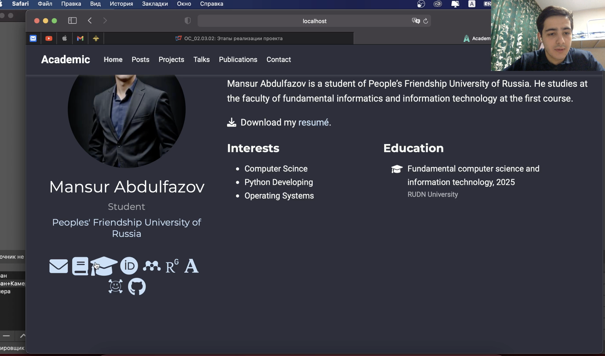
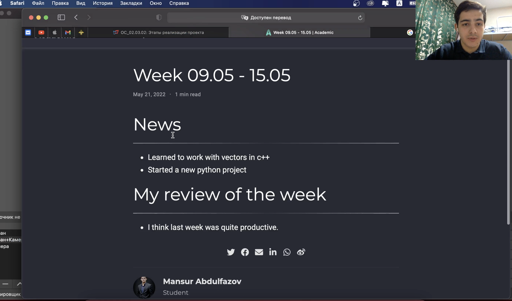
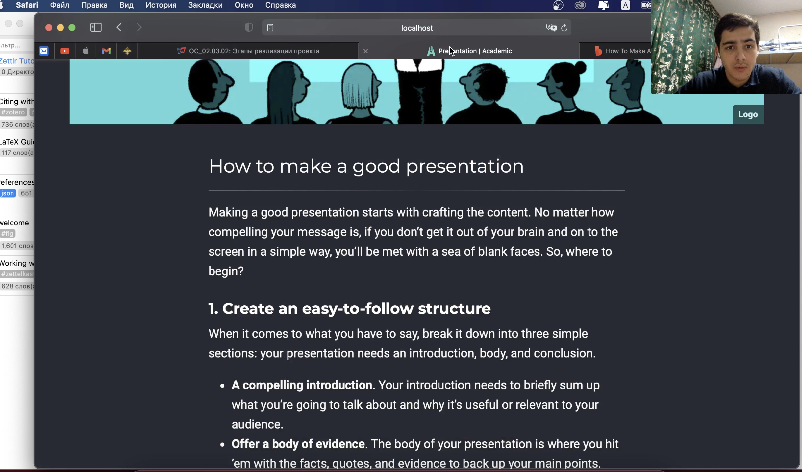

---
## Front matter
lang: ru-RU
title: Индивидуальный проект. Этап 4
author: Мансур А. о. Абдулфазов\inst{1,3}
        Группа НФИбд-01-21
date: 21 мая, 2021, Россия, Москва

## Formatting
toc: false
slide_level: 2
theme: metropolis
header-includes: 
 - \metroset{progressbar=frametitle,sectionpage=progressbar,numbering=fraction}
 - '\makeatletter'
 - '\beamer@ignorenonframefalse'
 - '\makeatother'
aspectratio: 43
section-titles: true
---

## Цель работы

Добавить к сайту ссылки на научные и библиометрические ресурсы.

## Выполнение лабораторной работы

1. Зарегистрировался на соответствующих ресурсах и разместил на них ссылки на сайте.

{ #fig:001 width=90% }

##

2. Сделал пост по прошедшей неделе.

{ #fig:002 width=90% }

##

3. Добавил пост на тему создание презентаций.

{ #fig:003 width=90% }

## Вывод

Добавил к сайту ссылки на научные и библиометрические ресурсы.

