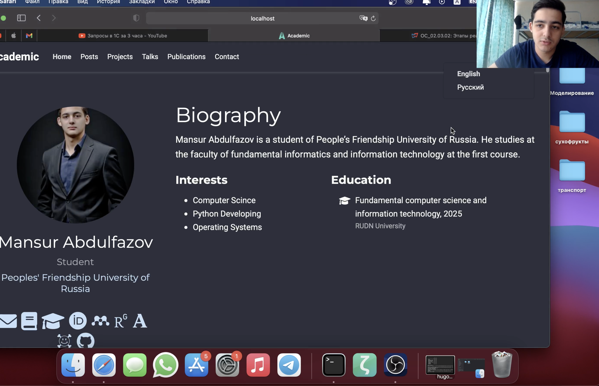
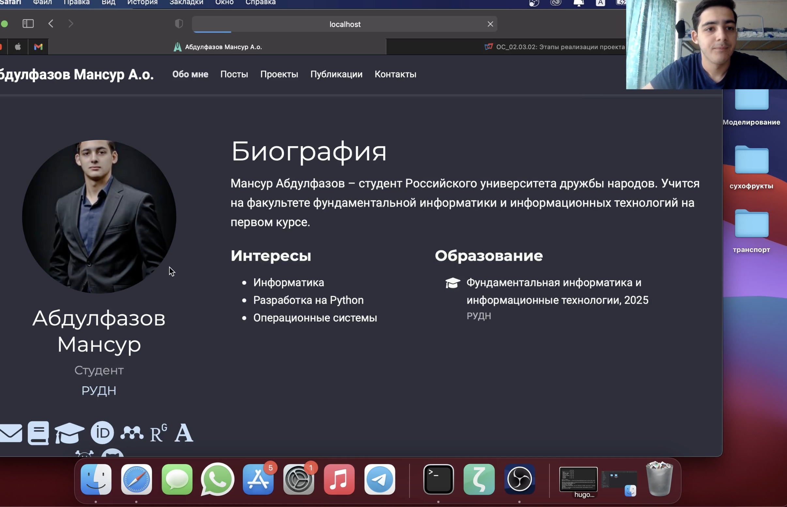
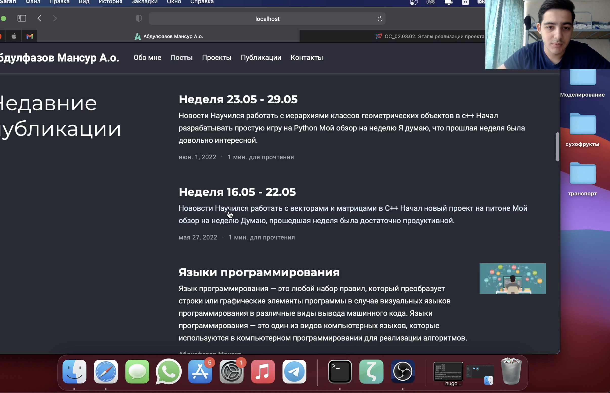
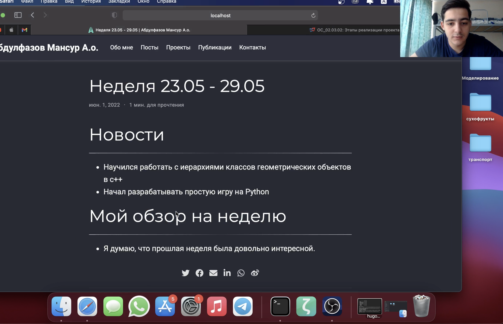
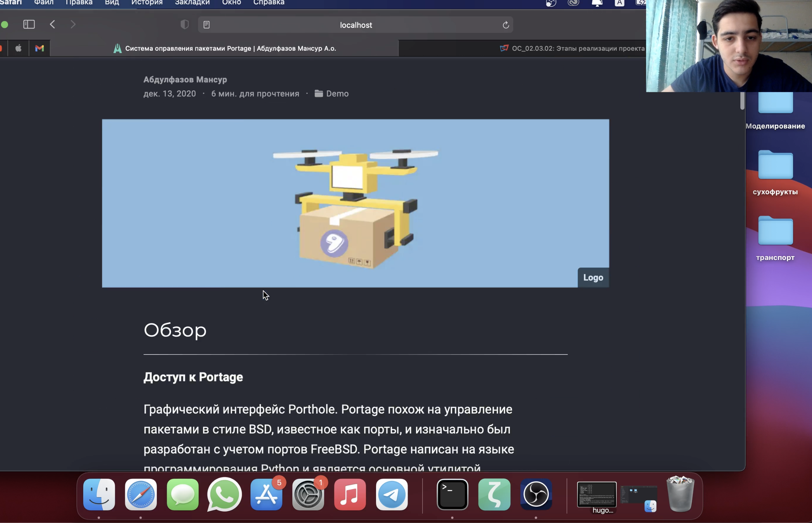

---
## Front matter
lang: ru-RU
title: Индивидуальный проект. Этап 6
author: Мансур А. о. Абдулфазов\inst{1,3}
        Группа НФИбд-01-21
date: 1 июня, 2021, Россия, Москва

## Formatting
toc: false
slide_level: 2
theme: metropolis
header-includes: 
 - \metroset{progressbar=frametitle,sectionpage=progressbar,numbering=fraction}
 - '\makeatletter'
 - '\beamer@ignorenonframefalse'
 - '\makeatother'
aspectratio: 43
section-titles: true
---

## Цель работы

Размещение двуязычного сайта на Github.

## Выполнение лабораторной работы

1. Сделал поддержку английского и русского языков.

{ #fig:001 width=90% }

##

2. Разместил элементы сайта на обоих языках.

{ #fig:002 width=90% }

##

3. Разместил контент на обоих языках.

{ #fig:003 width=90% }

##

4. Сделал пост по прошедшей неделе.

{ #fig:004 width=90% }

##

5. Добавил пост на тему по выбору (на двух языках).

{ #fig:005 width=90% }

## Вывод

Разместил двуязычный сайт на Github.
